# Complete Deployment Walkthrough

POSM development has now progressed to the point that we can fully deploy data to both the POSM's Area of Interest as well as OpenMapKit Android.

## HOT Export Tool

The HOT Export Tool is used to get the larger Area of Interest data from OpenStreetMap onto the POSM. The two main components that it packages for you are 1) OSM PBF, the vector data,  and 2) MBTiles, basemap tiles.

POSM itself generates tiles, called _POSM Carto_ on the device itself, but it is often useful to have the HOT Export Tool fetch tiles for you on the internet as well--especially if you want to have a satellite basemap.

Currently, the POSM HOT Export Tool can be reached at:

http://ec2-52-32-62-7.us-west-2.compute.amazonaws.com

Name and describe your export. On the right, make sure you have selected _Select Export Area_, and draw a bounding box to server as your Area of Interest.

*Describe an Export*

Choose the file formats you want. You want to at least have OSM PBF. OSMAnd OBF is a bonus, because you can load your extract in OSMAnd. If you want the export tool to generate an MBTiles basemap from the internet, check _MBTiles_.

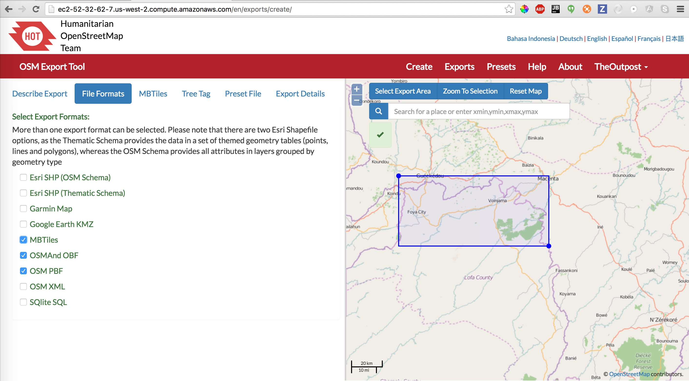
*File Formats*

If you would like to have an MBTiles basemap fetched from the internet _(optional)_, you need to specify the tile template URL and zoom levels to be fetched. This task by far takes the longest, and the generated MBTiles file can be _huge_... You can use [Geofabrik's Tile Calculator](http://tools.geofabrik.de/calc/) to help you determine how big your MBTiles is likely to be.

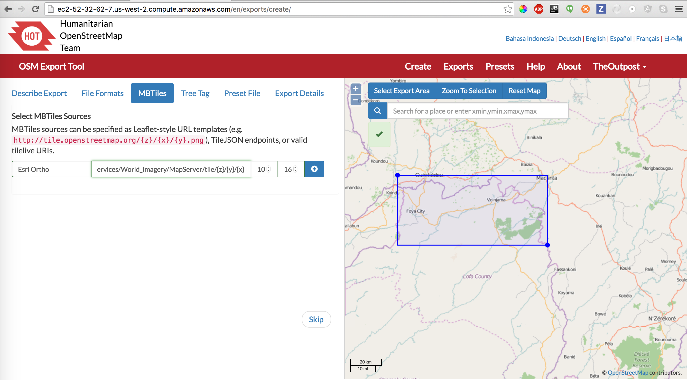
*MBTiles Source URL*

Finally, you need to __Create Export__.

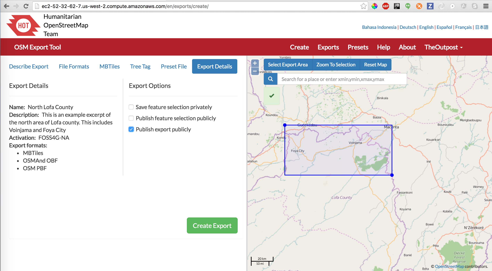
*Export Details*

The export begins by fetching OSM data from the Overpass API. This may take a while, and if you are creating  MBTiles, it may even take hours. You will be emailed when the export is complete.

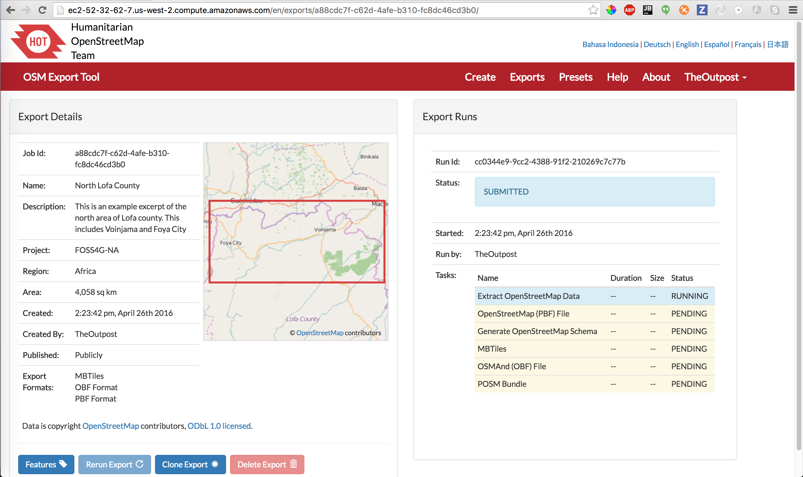
*Beginning of Export*

Once your export is completed, right click on __POSM Bundle__ and copy the URL.

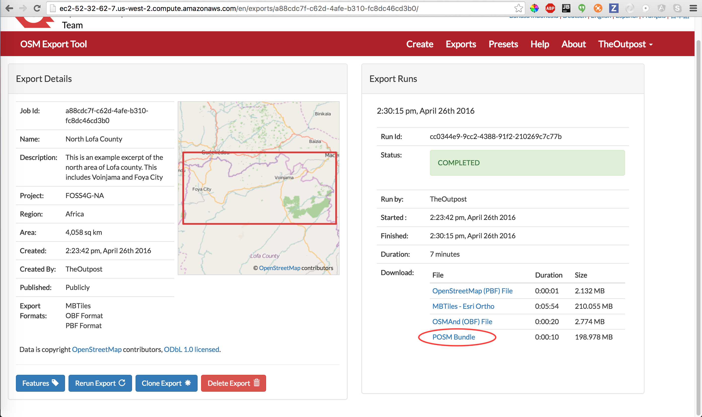
*Completed Export*

## POSM Area of Interest Deployment

The POSM needs to fetch the data generated by the HOT Export tool, load it's databases, and setup it's applications for the Area of Interest.

Make sure you are connected to the __POSM__ wifi network. Then, connect to the POSM by going to:

http://posm.io

go to __POSM ADMIN__.

Paste the __POSM Bundle__ url in the text area and __START__.

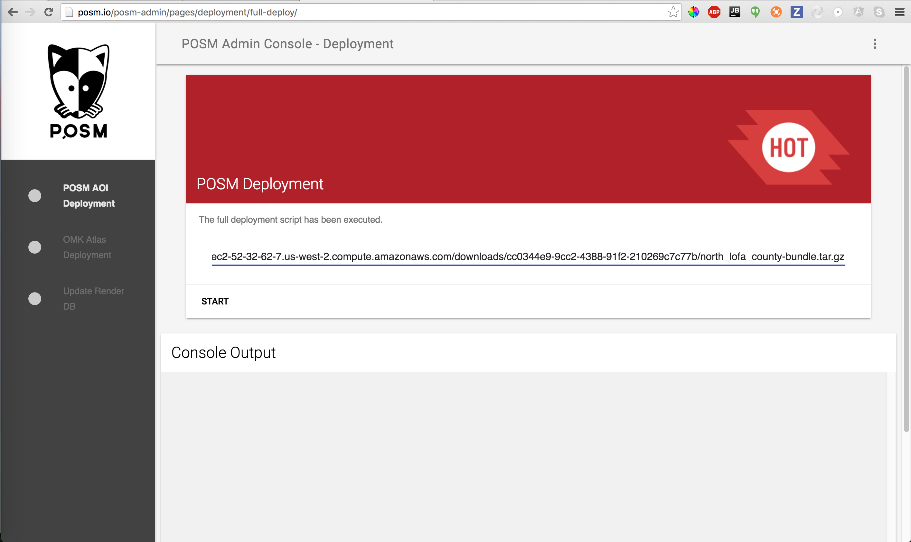
*Enter URL*

When the POSM Area of Interest (AOI) Deployment is complete, you will see a check box next to the task, and the console output will say `==> tessera-fp-reset.js: END false`. This means that it is finished.

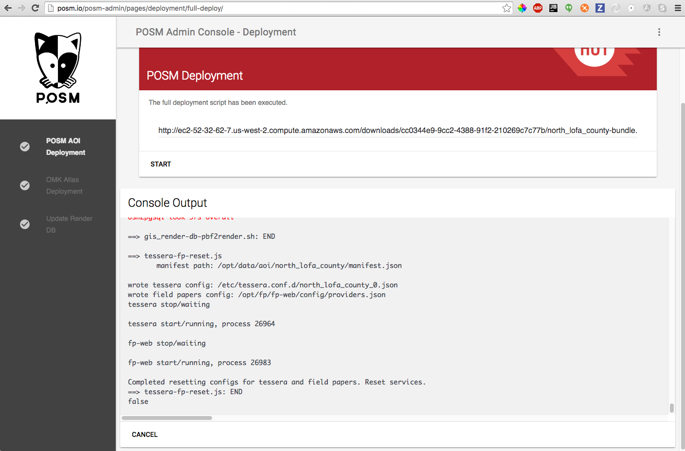
*Completed AOI*

Now, let's do a sanity check to see if the data has loaded correctly. Click on __EDIT OPENSTREETMAP__ in the POSM Portal, or go to http://osm.posm.io

It may take a little while to start cutting tiles, but zoom out and zoom into the area that you loaded. You should see tiles being drawn.

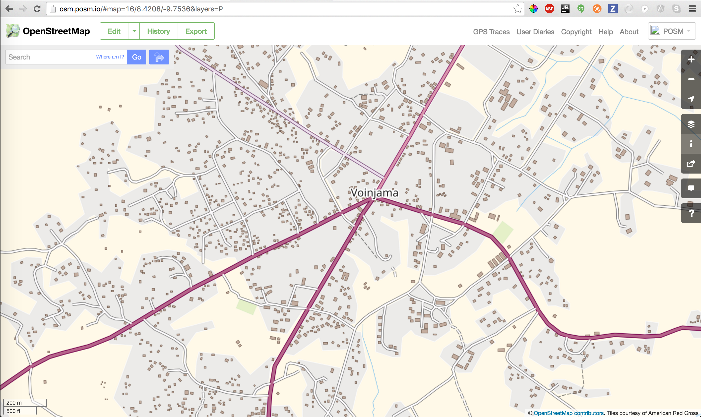
*POSM Carto Tiles in OpenStreetMap*

Also check Field Papers.

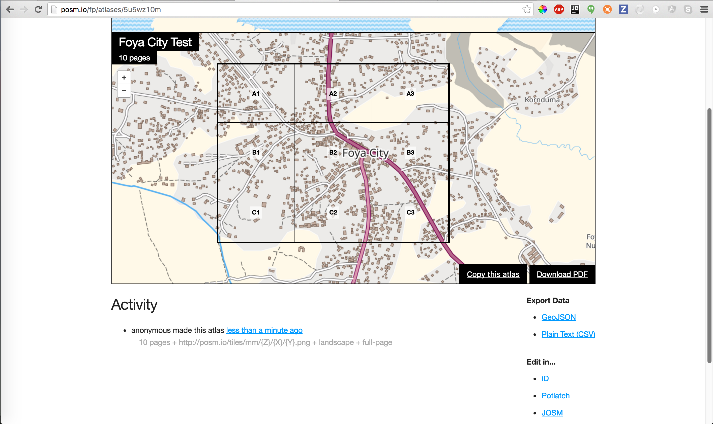
*Tiles in Field Papers*

## Field Papers → OpenMapKit Atlas Deployment

The deployments that you see in OpenMapKit are based off of the bounds of a Field Paper atlas. The entire Area of Interest is too large for the phone, so instead, our deployment is based off of a field paper atlas.

When you create a field paper, an atlas is generated, and we are using it's slug for the __name__, the __title__ for the title you gave the field paper, and the __GeoJSON__ for drawing the bounds of each field paper page in OpenMapKit.

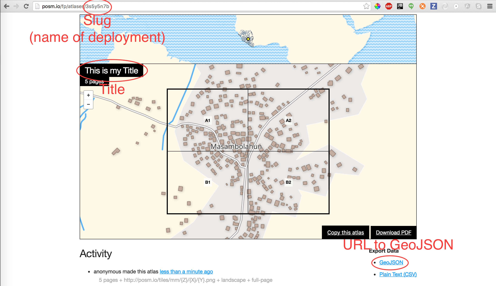
*Components of an Atlas*

This step is soon to be automated, but now we manually enter the URL to the Atlas's GeoJSON. This data encompasses the shapes that make up both the atlas as a whole as well as each page in the atlas. It also includes necessary metadata. We are using this data to generate a deployment for OpenMapKit. The name of the deployment is the _slug_, and the title is the title you gave the field paper.

*Pasting Atlas GeoJSON URL*

POSM is generating OSM XML from the API Database, POSM Carto MBTiles, and an extract of any other MBTiles included with the AOI.

*Generating Field Papers OpenMapKit Deployment*

When the deployment is complete, you should see `==> gis_omk-posm-mbtiles.sh: END false`.

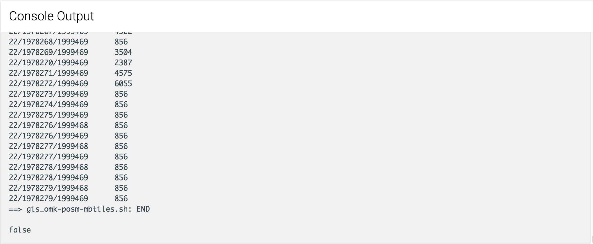
*End of Script*

You should also have all of the steps checked off.

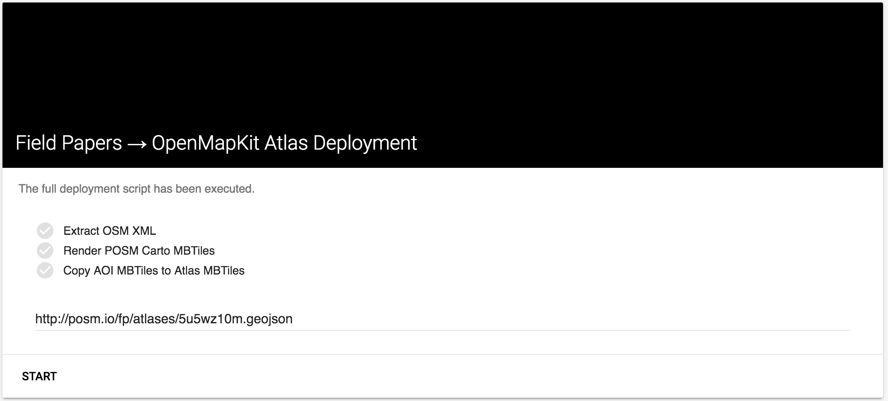
*Deployment Complete*

## OpenMapKit Android - Download Deployment

Now you are read to download a deployment on your phone. You can enter the server URL to your POSM, but scanning the QR Code on a field paper will also switch you to the correct URL of the POSM server. You can also manually enter the POSM Server's URL. It is http://posm.io

Make sure your phone is connected to the __POSM__ wifi network.

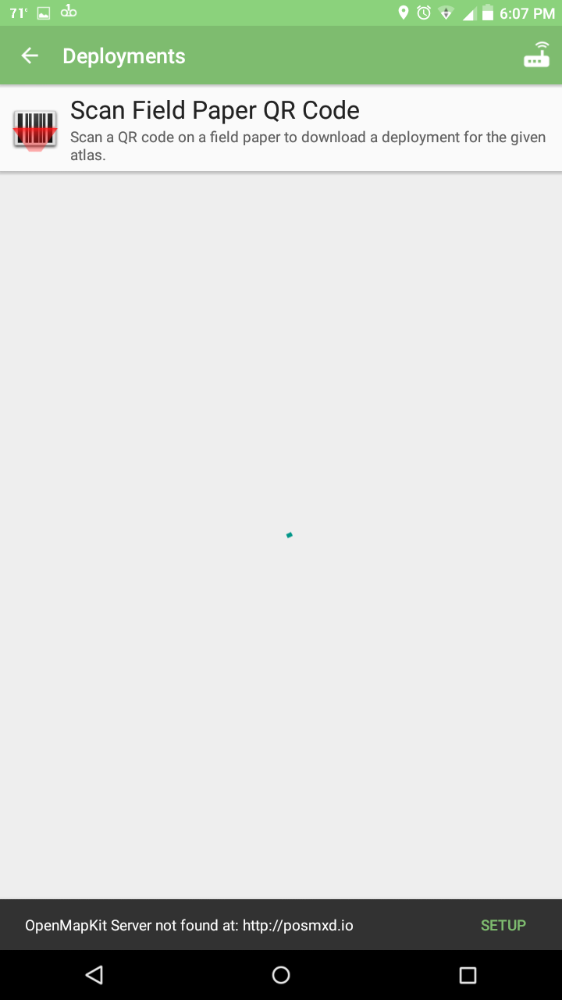
*No Server Setup Yet*

The QR Code will be read, and it will bring you to the corresponding deployment.

*Deployment Details*

Now you can download it by pressing the button in the lower right.

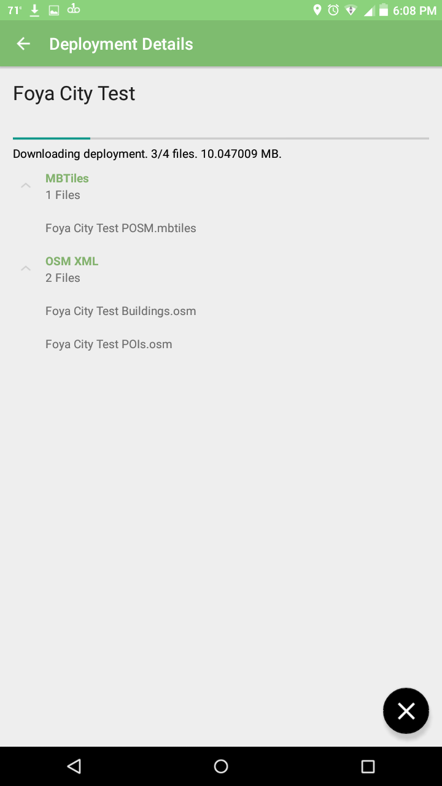
*Downloading*

If you jump back to the previous screen, you can see the list of deployments on the POSM's OpenMapKit Server.

*List of Deployments*

Once your download is complete, there will be a new button in the bottom left to __Check Out__ your deployment. This will turn on the POSM Carto MBTiles and OSM XML on the map for you.

*Download Complete*

You should also see the bounds of your field paper atlas pages. The top of the map should show the page that is green below.

*Field Paper with Pages*

## Also...

Before, you always had to start with ODK Collect. Now, if you start from OpenMapKit and try to edit a feature, the app will lead you back to ODK Collect to fill in your survey.

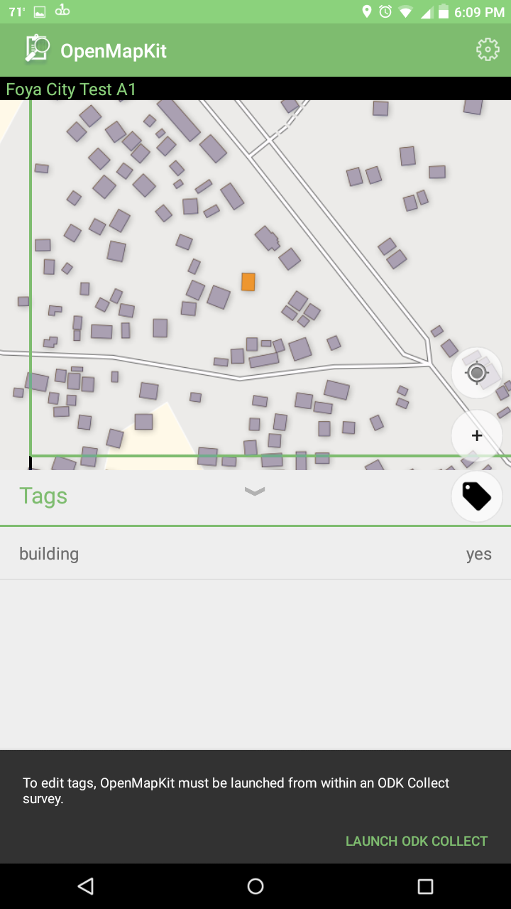
*Notice to Launch ODK Collect*

Once you've gotten back into OpenMapKit _from_ ODK Collect, you can edit tags as usual.

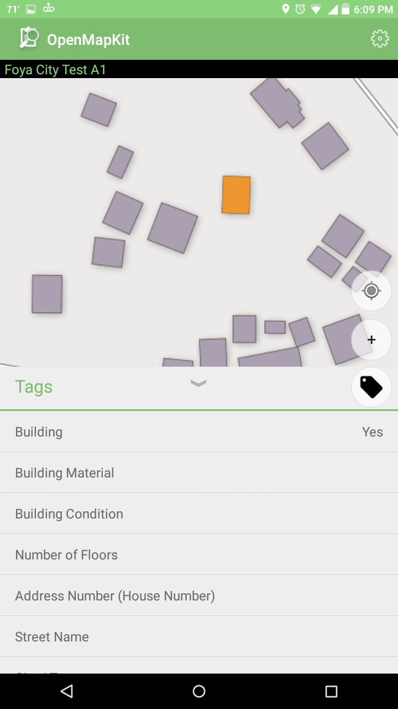
